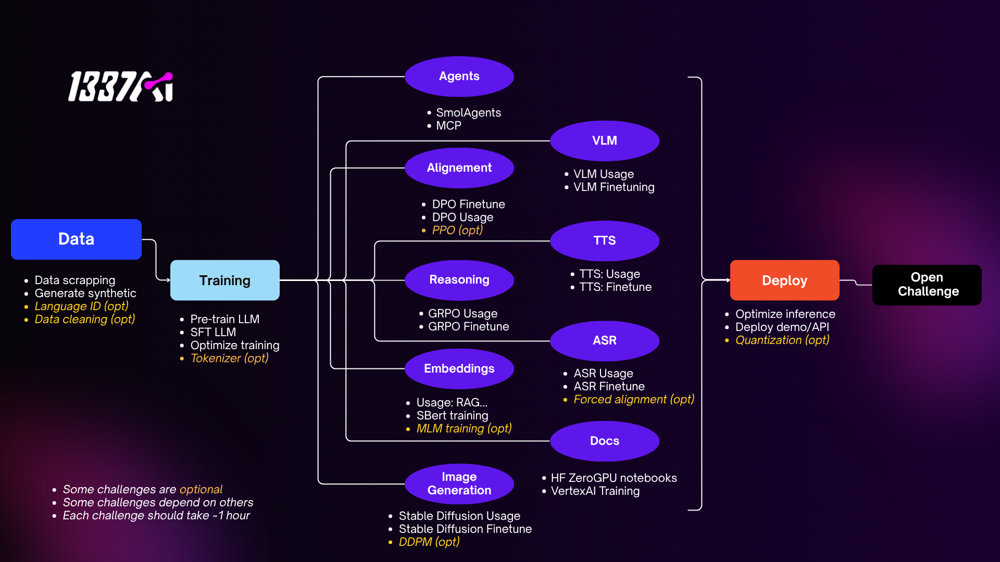

# HackAI Morocco 2025

  <h2>🤝 Contributions Welcome!</h2>
  
We welcome contributions from the community! Whether it's fixing bugs, adding new notebooks, or improving documentation, every contribution helps make this project better.

## About
HackAI Morocco is a 4-day AI hackathon that brings together students from across Morocco for an unforgettable experience filled with innovation, challenges, and learning. This unique event combines technical excellence with creative problem-solving in the field of artificial intelligence.

## Event Details
- **Date**: May 22-25, 2025
- **Location**: Morocco
- **Duration**: 4 Days
- **Format**: In-person hackathon

## Key Highlights
- AI Conference with industry experts
- Hands-on hacking sessions
- Networking opportunities
- Mentorship from AI professionals
- Roadmap covering the most in-demand GenAI skills

## Prizes
- 🏆 1st Place: 20,000 MAD
- 🥈 2nd Place: 12,000 MAD
- 🥉 3rd Place: 8,000 MAD

## Hackathon Challenges

### HackAI 2025 Roadmap
The roadmap at the time of the hackathon looked like this, where each challenge corresponds to a notebook and granted the participants a number of points.

### Available Notebooks
We're actively maintaining the notebooks in this repository for similar hackathons, feel free to open a PR to suggest modifications or suggest a new notebook!

| Category | Challenge | Description | Notebook |
|----------|-----------|-------------|-----------|
| 📊 **Data Processing & Analysis** | Data Cleaning | Clean and process Moroccan Arabic (Darija) datasets | COMING SOON |
| | Language Identification | Build systems for Arabic dialect identification |  |
| | Web Scraping | Create efficient data collection pipelines using BeautifulSoup4 |  |
| | Tokenizer | Build and train custom tokenizers | COMING SOON |
| | Synthetic Data Generation | Generate synthetic data for training |  |
| 🏋️‍♂️ **LLM Training** | LLM Pretraining | Pretrain your first LLM |  |
| | SFT LoRA | Fine-tune models using LoRA |  |
| | Optimize Training | Optimize LLM training process | COMING SOON |
| 🚀 **Deployment** | Optimize Inference | Optimize model inference | COMING SOON |
| | Deployment Demo | Deploy models with API | COMING SOON |
| | Quantization | Quantize models for efficient deployment | COMING SOON |
| 🤖 **AI Agents & Prompt Engineering** | MCP | Build an MCP server |  |
| | SmolAgents | Develop agents that can effectively use tools and APIs using smolagents like tools |  |
| | Prompt Engineering | Create robust and efficient prompts for various AI applications |  |
| 🔄 **Alignment** | DPO Training | Implement Direct Preference Optimization for Arabic language models |  |
| | DPO Usage | Use DPO for model alignment | COMING SOON |
| | PPO Training | Develop models using Proximal Policy Optimization |  |
| 🧠 **Reasoning** | GRPO for Math | Fine-tune models for mathematical reasoning |  |
| 🎤 **Automatic Speech Recognition** | ASR Usage | Implement automatic speech recognition |  |
| | ASR Finetuning | Finetune ASR models | .ipynb) |
| | Word Level Alignment | Implement word-level force alignment |  |
| 🗣️ **Text-to-Speech** | TTS Usage | Text-to-speech implementation | COMING SOON |
| | TTS Finetune | Fine-tune TTS models | COMING SOON |
| 📊 **Embedding models** | SBERT Embedding | Fine-tune SBERT model |  |
| | Pretrain MLM | Masked Language Modeling Training |  |
| | RAG/Classification | Use embeddings for RAG and classification | COMING SOON |
| 🎨 **Image Generation** | DDPM | Denoising Diffusion Probabilistic Models | COMING SOON |
| | Stable Diffusion Usage | Use Stable Diffusion models | COMING SOON |
| | Stable Diffusion Finetune | Fine-tune Stable Diffusion models | COMING SOON |
| 👁️ **Vision Language Models** | VLM Usage | Use Vision Language Models | COMING SOON |
| | VLM Finetuning | Fine-tune Vision Language Models | COMING SOON |

## Speakers
- Achraf Mamdouh (Senior Software Engineer @ Google)
- Jawad Alaoui (Software Engineer and CEO @ Norma)
- Mehdi Bennani (Research Engineer @ Google DeepMind)

## Mentors
Our team of experienced mentors includes professionals from:
- Google
- Hugging Face
- Sigma Nova
- Impactera
- ToumAI Analytics
- And more...

## Organizers
The event is organized by a dedicated team of students and professionals from 1337AI and friends

## Resources
- [Official Website](https://hackai.ma)

## Contact
For any inquiries, please reach out to us through our [contact form](https://hackai.ma/contact).

---

*Join us for an extraordinary journey into the world of AI innovation!* 